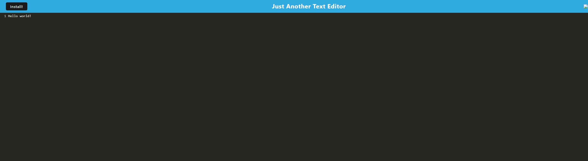

  # PWA Text Editor
  

  ## Table of Contents
  * [License](#License)
  * [Description](#Description)
  * [Installation](#Installation)
  * [Notes](#Notes)
  * [Questions](#Questions)
  
  ## License
  
            
  ## Description
  A simple browser based text editor that can be installed locally
  [Deployed App] (https://jate-text-editor.herokuapp.com/)  
  [Github Repository] (https://github.com/dearg-amadaun/19-PWA-NoteTaker)   
  
  ## Installation
  Local To use the app locally; pull the repository onto your local machine ann run npm install in the vs code terminal to install the dependancies, followed by npm start to run the local sevrer. Then you can navigate to the app at http://localhost:3000/ in your web browser.

  ## Notes
  I have most of the functionality currently working, but there were definitely a few stumbling points. I need to troubleshoot installing locally from the web application. The app saves and caches successfully but I also need to troubleshoot recalling stored information.
  
  ## Questions
  Please direct any questions or comments to:
  dearg-amadaun
  brottmund@gmail.com
  
